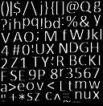
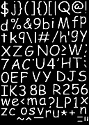
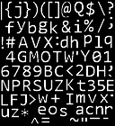

# MAGE-SpritFont

## About
A command line tool for generating binary sprite fonts for use with `mage::SpriteFont` in [MAGE](https://github.com/matt77hias/MAGE).

## Codebase
Based on:
* [DirectXTK](https://github.com/Microsoft/DirectXTK) [[License](https://github.com/matt77hias/MAGE-SpritFont/blob/master/LICENSE.txt)]
